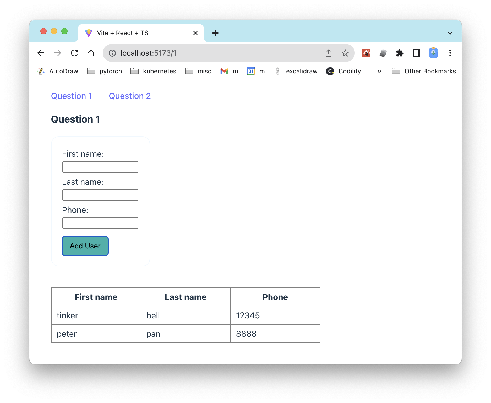
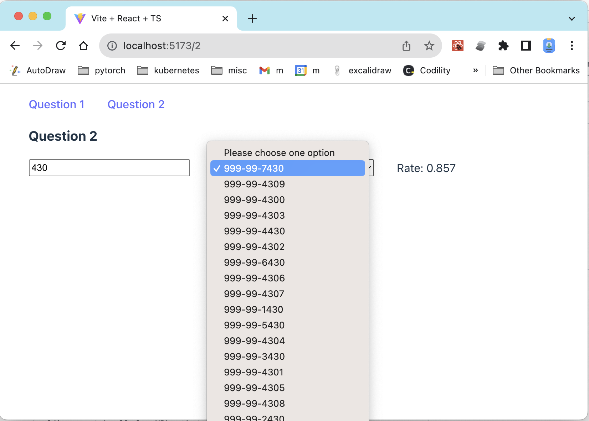

# Question 1
1. react frontend
1. make an ui to user first name, last name, phone number and "save it"

# Question 2
1. data processing
1. lookup a user's social security number and credit score in order to get interest rate.

